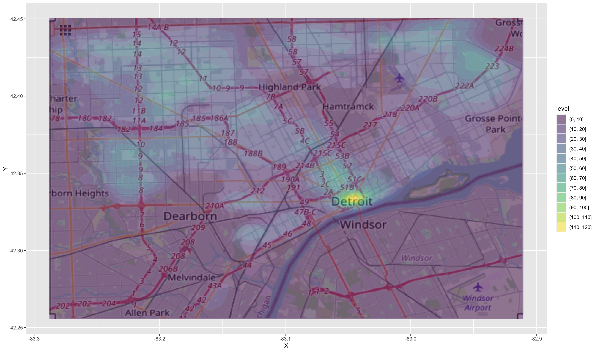

```{r setup, include=FALSE}
knitr::opts_chunk$set(echo = TRUE)
library(tidyverse)
library(magick)
```


## Question 1 (6 points)

In this question, we will investigate the real estate market in Texas over the period 2000 to
mid-2015. The data in the `txhousing` table records monthly information for `r length(unique(txhousing$city))` cities in Texas. Information includes the total number of sales made, the median sales price within the month, and several other pieces of information.

### Part a (2 points)
Here is a plot of total sales over time in Houston, Texas:

```{r}
houston <- filter(txhousing, city == "Houston")

ggplot(houston, aes(x = date, y = sales)) + geom_line()
```

Notice that there is a consistent rise and fall to the number of sales. We call such patterns "seasonal effects."

To help us better understand season effects, we can look at the results by month (ignoring the year of the sales information):

```{r, warning=FALSE}
ggplot(houston, aes(x = as.factor(month), y = sales)) + geom_point()
```

Improve this plot in the following ways:

* Either use a geometry that computes summary statistics or add a statistic to this plot that helps us better see the trends involved.
* In the above plot, January and December are on opposite ends of the plot. Change the plot to better reflect the fact that these months are adjacent on the calendar. 


### Part (b) (2 points)

Here is a plot of median (within month) sales prices over time, attempting to breakdown the data by 
region.

```{r fig.height = 10}
ggplot(txhousing, aes(x = date, y = median, color = city)) + 
  geom_point() + 
  theme(legend.position="bottom")
```

* What would be a better way to display these data to help us understand the behavior of different cities? Describe in words what you see that could be improved with this plot?
* Implement your idea plot. Note the use of `fig.height = 10` and the `theme` function in the example. These may be useful to you as well.
* What area
saw the biggest increase in median price during this period? 
* Which areas have
the largest month-to-month swings in sales in prices?


### Part c (2 points)

Create a boxplot that visualizes the average monthly sales variation for each city.
For each city also show the mean sale value as a blue point.
Use the `stat_` function in `ggplot2` to summarize and display the information.
Do not show the boxplot outliers. Make sure that your city labels are legible.


## Question 2 (6 points)

For this question, let's look at some crime report information from the City of Detroit:
```{r}
crime <- read_csv("./data/RMS_Crime_Incidents.csv.gz", show_col_types = 'FALSE')
```

If you want to see the source of this data: [City of Detroit crime event data](https://data.detroitmi.gov/datasets/detroitmi::rms-crime-incidents/explore).

Description from the City of Detroit Open Data Portal:

> This data reflects reported criminal offenses that have occurred in the City of Detroit. Offense data was extracted from the Detroit Police Department's records management system.
>
> This data reflects reported criminal offenses that have occurred in the City of Detroit. Offense data was extracted from the Detroit Police Department's records management system. This data set contains the most recent data available and is updated anytime DPD sends official crime records contributing to the Michigan Incident Crime Reporting (MICR) or the National Incident-Based Reporting systems (reflected by the IBR Date field). It should be noted that some incidents involve the commission of multiple offenses, such as a domestic assault where property was also vandalized. Accordingly, the data describe all offenses associated with all reported incidents.

### Part (a) (3 points)

Let's get to know the data. Answer the following questions about the data set:

* How many rows and columns are in this data set?
* What are the column names?
* How many precincts are there? Hint: explore the functions `n_distinct` and `unique`
* What is the median latitude (`Y`) and median longitude (`X`) of these crimes?
* What many proportion of crimes occur between 12pm and midnight?
* What is the most common offense category in zip code 48239?

### Part (b) (1 point)

Using an appropriate plot show the marginal distribution of the offense category. Ensure the labels do not overlap to receive full credit.


### Part c (2 points)

Read the help documentation for the `geom_density_2d_filled` and the `annotation_raster` functions to create a two dimensional density plot on top of the map of Detroit. Pay careful attention to how you can make the density plot sufficiently transparent to show the underlying map and how you can make the map line up with the proper longitude (`X`) and latitude (`Y`) coordinates.

Your solution should look approximately like this:



```{r}
det <- image_read("detroit.png")
```

## Question 3 (8 points)

## Part a (2 points)

The `year` column of this data set includes some suspect values. Filter the table so that it only includes values of `year` 2016 or later. Save the results to a `crime2` table. **We will use `crime2` for the rest of the assignment.**

Using this table, precisely how many crime events occurred in each year?


### Part b (2 points)

Let's focus on a specific subset of questions for this question. Temporarily filter the table to just "crimes of interest".

```{r}
crimes_of_interest <- c("AGGRAVATED ASSAULT", "ARSON", "ASSAULT", "HOMICIDE", 
                        "JUSTIFIABLE HOMICIDE", "KIDNAPPING", "SEX OFFENSES", 
                        "SEXUAL ASSAULT", "WEAPONS OFFENSES")
```

Group the data by year and offense category. Count the number of each time of crime that occurs in each year. Graph these results as a line plot with one line for each time of crime. Which crime type has increased the most in this time.

### Part c (2 points) 

Grouping first by `neighborhood` and then `year`, count up the number of of times of an occurrence of a crime in a neighborhood for each year. (hint: recall the `n()` function).

Then group by `neighborhood` only and calculate the average number of crime occurrences in a given neighborhood per year. At this point, you should have a table of neighborhoods with average crime counts per year. Sort this in descending order by crime count per year and report the top 3 neighborhoods, from most crimes per year to least crimes per year. (hint: use the `arrange()` function).


### Part d (2 points)

The `incident_time` value is what hour of day the event occurred. If we computed averages of these values, we would ignore the fact that 11:59pm is closer to 00:01am than 10:00pm.

Read up on the [circular means](https://en.wikipedia.org/wiki/Circular_mean), which can more appropriately average events that occur periodically.

* Convert each incident time (convert to seconds since 00:00am using `as.numeric`) to its fractional hour (e.g. 3:30pm would be 15.5). 
* For each neighborhood, compute the circular mean time of event. 
* Convert this back to the 24 scale (hint: you will get some positive and some negative angles, multiply these by 24 and then take mod 24 (`%% 24`). How many neighbors have an average incident time between 11pm and 1am?


